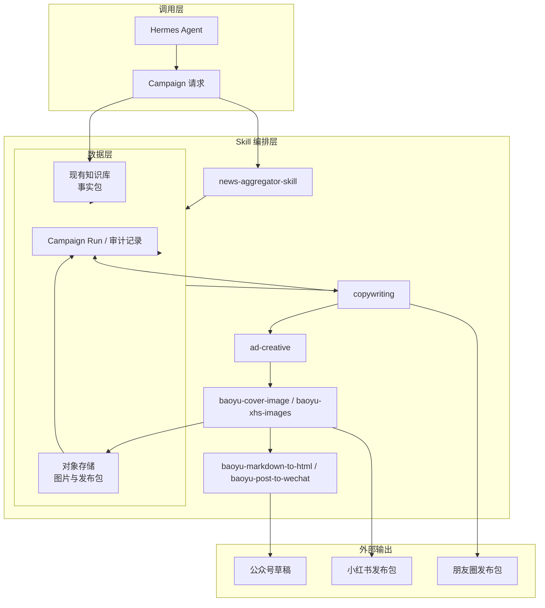
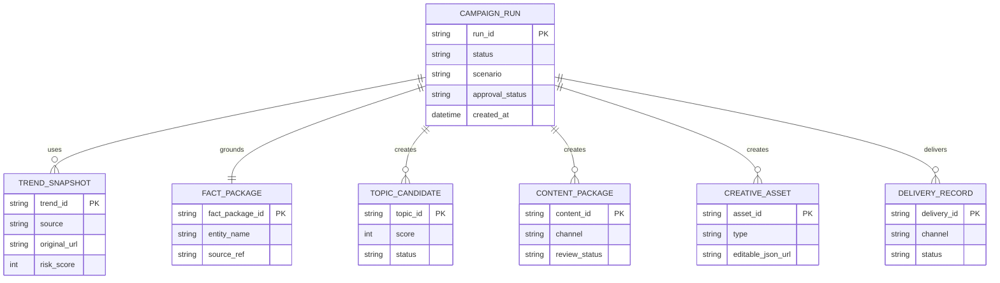
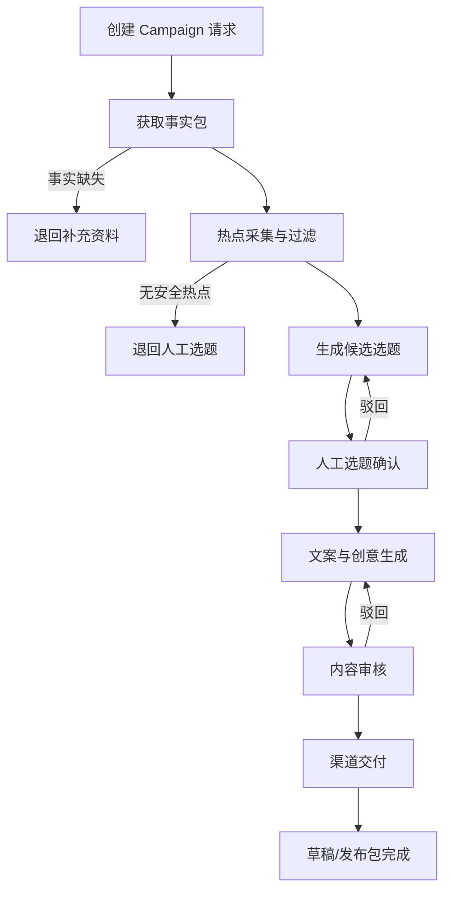
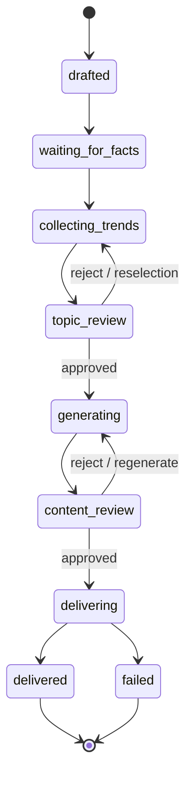

# 营销内容 Agent 两周上线 PRD 与落地实施方案

| PRD 审核人 | [TODO: 指定业务负责人、技术负责人] |
| --- | --- |
| 重要性 | 高 |
| 紧迫性 | 高 |
| 需求方 | 自媒体 Agent / 楼宇营销业务团队 |
| PRD 编写人 | [TODO: 指定] |
| PRD 提交日期 | 2026-07-11 |
| 目标上线日期 | 2026-07-24（两周内） |

## PRD 修改记录

| 变更时间 | 变更内容 | 变更提出部门与理由 | 修改人 | 审核人 | 版本号 |
| --- | --- | --- | --- | --- | --- |
| 2026-07-11 | 初始版本 | 验证“热点 + 现有知识库 + 多渠道内容分发”闭环 | [TODO] | [TODO] | v1.0 |

---

## 1、项目背景

### 1.1 业务现状

楼宇营销人员需要持续生产公众号、小红书和朋友圈内容，但当前热点发现、楼宇资料查找、选题、改稿、制作海报和发布分散在多个工具与人工环节中。业务团队已有知识库，不需要重建 RAG；本期只消费其检索结果或用户提供的单份/多份项目资料。

### 1.2 面临问题

1. **热点无法稳定转为可用选题**：热搜存在敏感、灾害、争议和与业务无关内容，人工筛选慢且不可追溯。
2. **楼宇事实容易失真**：文案可能混用不同项目的面积、交通、租金或配套，缺少来源与禁用词约束。
3. **多渠道重复生产**：同一营销主题需分别写公众号、小红书、朋友圈，格式与审核要求不同。
4. **图文交付不可复用**：没有统一的素材包、可编辑海报图层和发布记录。

### 1.3 解决思路

以 Hermes Agent 为唯一编排入口，串联已有开源 Skills：热点聚合、内容策略、文案、创意、封面/图文卡片、公众号排版与草稿创建。知识库只提供本次项目的“营销事实包”；Agent 将每次执行记录为一个 Campaign Run，返回选题、文案、图文和渠道发布包。

### 1.4 决策依据

- 本期优先验证内容生产闭环，不建设独立控制台、知识库或多租户平台。
- 公众号支持 API 草稿能力，适合作为唯一的自动交付通道。
- 小红书自动发布依赖浏览器会话与 Cookie，存在风控风险，因此本期只生成发布包；自动发布在后续灰度验证。

> 💡 方法论提示：以“最小业务闭环”定义 MVP，而不是以页面数量定义 MVP。

## 2、需求基本情况

| 要素 | 内容 |
| --- | --- |
| 需求提出人 | 楼宇营销/自媒体 Agent 业务团队 |
| 功能使用人 | 营销运营、销售顾问、内容审核人 |
| 受影响人 | 公众号运营人员、项目招商负责人、最终客户 |
| 场景描述 | 围绕一个楼宇/项目，借安全热点生成并交付多渠道营销内容 |
| 发生频率 | 高频，预期每日多次；[TODO: 确认目标日均 Run 数] |
| 核心痛点 | 内容生产慢、事实不可控、发布准备重复 |
| 需求价值 | 将单次内容生产压缩为“输入项目资料 → 审核 → 发布/导出” |

### 核心场景：楼宇热点营销内容生产

- **人物**：营销运营人员或销售顾问。
- **时间**：每日热点出现后，或项目需要集中招商时。
- **地点**：Hermes Agent 对话入口；飞书仅是后续入口，不是本期前置依赖。
- **起因**：用户指定项目并要求生成小红书、公众号和朋友圈内容。
- **经过**：Agent 获取热点 → 接收知识库事实包 → 生成 3 个选题 → 人工确认 → 生成文案与图文 → 输出渠道包。
- **结果**：公众号创建草稿；小红书和朋友圈得到可下载的图片与文字包；每个结果均可追溯来源。

## 3、业务分析与系统调研

### 3.1 业务痛点优先级

| 排序 | 痛点描述 | 影响范围 | 严重程度 | 紧迫度 | 处理策略 |
| --- | --- | --- | --- | --- | --- |
| 1 | 项目事实缺失或不一致导致错误营销承诺 | 客户、销售、品牌 | 高 | 高 | 事实包、来源、禁用词、人工审核 |
| 2 | 热点不适合商业营销或有敏感风险 | 品牌、平台账号 | 高 | 高 | 多来源过滤、风险评分、人工选题 |
| 3 | 三渠道重复改写与排版 | 营销运营 | 中 | 高 | 一次生成渠道适配内容 |
| 4 | 图文与发布记录无法复用 | 销售、运营 | 中 | 中 | Run 级产物包与追溯报告 |

### 3.2 可借鉴开源能力

| 环节 | 采用能力 | 本期定位 | 不承担的职责 |
| --- | --- | --- | --- |
| 热点 | `news-aggregator-skill` | 聚合微博、36氪等来源并输出结构化热点 | 不判断楼宇匹配度 |
| 内容策略 | `content-strategy` | 将热点、受众、目标与事实包形成选题 | 不读取原始知识库 |
| 文案 | `copywriting` | 生成渠道文案与改写版本 | 不编造业务事实 |
| 创意 | `ad-creative` | 输出创意角度、标题和图文结构 | 不替代审核 |
| 图像 | `baoyu-cover-image`、`baoyu-xhs-images` | 生成封面/图文卡片 | 不生成电话、二维码等关键文本 |
| 公众号 | `baoyu-markdown-to-html`、`baoyu-post-to-wechat` | 排版并创建草稿 | 默认不直接群发 |

## 4、项目收益目标

### 4.1 两周交付目标

| 目标类型 | 目标描述 | 衡量指标 | 目标值 | 达成时限 |
| --- | --- | --- | --- | --- |
| 核心业务目标 | 完成一次营销内容生产闭环 | 从输入资料到产物包成功率 | >= 90%（UAT 样本） | 第 10 个工作日 |
| 效率目标 | 降低运营准备时间 | 单个项目首稿产出耗时 | <= 10 分钟，不含人工审核 | 第 10 个工作日 |
| 质量目标 | 保证可追溯和可审核 | 产物含热点来源、知识资料来源、禁用词校验 | 100% | 第 10 个工作日 |
| 渠道目标 | 交付三渠道内容 | 公众号草稿载荷 + 小红书包 + 朋友圈包 | 100% | 第 10 个工作日 |

### 4.2 验收标准

1. 输入一份项目资料或现有知识库检索结果，可生成包含至少 3 个候选选题的 Campaign Run。
2. 每个候选选题必须显示热点标题、来源链接、风险等级、所引用的项目事实。
3. 审核通过后生成公众号 Markdown/HTML 草稿载荷、小红书图文发布包、朋友圈图片与话术包。
4. 所有项目卖点、交通、面积、租金、联系人必须来自事实包；缺失字段必须标为“待确认”，不可被模型补全。
5. 公众号默认仅创建草稿；小红书自动发布不作为 P0 验收项。

## 5、项目方案概述

### 5.1 核心功能清单

| 序号 | 功能模块 | 功能简述 | 优先级 |
| --- | --- | --- | --- |
| 1 | Campaign 请求与事实包 | 接收项目资料或现有知识库检索结果 | P0 |
| 2 | 热点采集与风控 | 聚合热点、标准化、去重、风险过滤 | P0 |
| 3 | 选题策略 | 输出并排序 3 个以上热点营销选题 | P0 |
| 4 | 多渠道文案 | 生成公众号、小红书、朋友圈文案 | P0 |
| 5 | 图文与海报 | 生成主视觉、海报/卡片及可编辑图层 | P0 |
| 6 | 渠道交付 | 创建公众号草稿载荷，导出小红书/朋友圈包 | P0 |
| 7 | 运行追溯 | 保存输入、来源、审核、产物与状态 | P0 |
| 8 | 小红书自动发布 | 真实账号登录和发布 | P1 灰度 |
| 9 | 控制台/工作台 | 可视化编辑、历史管理 | P2，不在本期 |

### 5.2 MVP 边界

**本期包含**：Skill 编排、现有知识库输入、热点采集、审核前选题、文案与图文、公众号草稿、导出包、审计记录。

**本期不包含**：独立控制台、知识库重建、RAGFlow、朋友圈自动发布、小红书无人值守自动发布、数据效果自动回流。

## 6、项目范围

| 系统/组件 | 关系类型 | 本期动作 | 责任方 |
| --- | --- | --- | --- |
| Hermes Agent | 编排入口 | 调用 Skills、持久化 Campaign Run | Agent/后端团队 |
| 现有知识库 | 数据来源 | 提供检索结果或项目文档 | 知识库团队 |
| 开源 Skills | 业务能力 | 安装、配置、按顺序调用 | Agent 团队 |
| 热点数据源 | 外部来源 | 由热点 Skill 访问并保留原始链接 | Agent 团队 |
| 微信公众号 | 输出渠道 | 用凭证创建草稿 | 公众号运营 |
| 小红书/朋友圈 | 输出渠道 | 导出发布包 | 运营/销售 |

## 7、项目风险

| 风险 | 等级 | 处理方案 | 停止条件 |
| --- | --- | --- | --- |
| 热点源不可用或页面变更 | 中 | 多来源、超时、缓存、失败回退 | 连续 3 次无可用热点时转人工选题 |
| 知识库事实错误或缺失 | 高 | 来源记录、必填字段校验、禁止补全 | 联系人/项目名缺失时禁止进入发布 |
| 小红书风控 | 高 | 本期仅导出包；自动发布单账号灰度且每次确认 | 账号异常立即停用自动发布 |
| 公众号凭证/权限未就绪 | 高 | 先输出草稿载荷；凭证到位后联调 | 第 4 个工作日未提供凭证则 P0 降级为载荷导出 |
| 图像质量不稳定 | 中 | 品牌参考图、模板文字图层、最多 2 次重生成 | 人工选择主视觉或替换项目实拍图 |

## 8、术语

| 术语 | 定义 |
| --- | --- |
| Campaign Run | 一次从热点到渠道包的完整营销任务，拥有唯一 `run_id` |
| 营销事实包 | 当前项目允许使用的结构化业务事实、素材、禁用词和来源 |
| 发布包 | 面向指定渠道的文案、图片、标签、草稿载荷和检查清单 |
| 审核 | 人工对选题、文案、海报和发布动作的确认 |

## 9、参考资料

- [DailyHotApi](https://github.com/imsyy/DailyHotApi)：可选热点聚合服务。
- [news-aggregator-skill](https://github.com/cclank/news-aggregator-skill)：热点采集 Skill。
- [baoyu-skills](https://github.com/JimLiu/baoyu-skills)：图像、公众号发布 Skills。
- [marketingskills](https://github.com/coreyhaines31/marketingskills)：内容策略、文案、创意 Skills。

## 10、功能需求

### 10.1 产品框架概述

### 10.1.1 核心数据模型

### 10.1.2 主流程与状态机

| 状态 | 进入条件 | 可执行动作 | 退出条件 |
| --- | --- | --- | --- |
| `waiting_for_facts` | 请求创建 | 补充/替换事实包 | 事实校验通过 |
| `topic_review` | 候选选题完成 | 选择、驳回、重拉热点 | 选题确认 |
| `content_review` | 文案和图文完成 | 改写、换图、批准 | 审核通过 |
| `delivering` | 审核通过 | 创建公众号草稿、导出包 | 渠道记录写入 |
| `delivered` | 所有目标渠道已完成 | 查看产物 | 结束 |

### 10.2 产品需求详解

#### 10.2.1 Campaign 请求与营销事实包

**输入方式**：Hermes Agent 传入已有知识库检索结果；首期兼容直接传入 Markdown/TXT 文档内容。

| 字段 | 必填 | 规则 |
| --- | --- | --- |
| `scenario` | 是 | 首期固定 `building_leasing` |
| `marketing_goal` | 是 | `lead_generation` / `sales_enablement` |
| `target_channels` | 是 | 公众号、小红书、朋友圈的任意组合 |
| `fact_package` | 是 | 项目名、城市、商圈、交通、联系人、卖点、来源 |
| `assets` | 否 | 楼宇实拍图、Logo、二维码；未提供则使用默认视觉并标记待替换 |
| `forbidden_claims` | 否 | 禁用营销表述，默认空 |

| 编号 | 规则类型 | 规则描述 |
| --- | --- | --- |
| F-01 | 事实 | 所有业务卖点必须能回溯到事实包字段或来源文档。 |
| F-02 | 约束 | 项目名、联系人、城市缺失时禁止进入渠道交付。 |
| F-03 | 约束 | 禁用词不得出现在文案、海报标题和渠道包。 |
| F-04 | 推论 | 未给出租金、面积等字段时，文案不得生成该项具体数值。 |

#### 10.2.2 热点采集与风险过滤

| 功能 | 要求 |
| --- | --- |
| 来源 | `news-aggregator-skill` 配置微博、36氪、腾讯新闻等；可选接入 DailyHotApi。 |
| 过滤 | 高风险政治、灾害、伤亡、犯罪、医疗、纠纷热点默认剔除。 |
| 追溯 | 保存标题、来源、原始链接、抓取时间、热度、风险分。 |
| 兜底 | 没有安全热点时返回“人工选题模式”，不得虚构热点。 |

#### 10.2.3 选题策略与文案生成

| 功能 | 使用 Skill | 输出 |
| --- | --- | --- |
| 选题 | `content-strategy` | 至少 3 个选题，附热点关联、事实引用、风险说明、评分。 |
| 文案 | `copywriting` | 小红书标题/正文/标签、公众号标题/摘要/Markdown、朋友圈话术。 |
| 创意 | `ad-creative` | 3 个视觉角度、标题层级和 CTA 建议。 |

业务规则：

1. 选题必须同时满足“热点低风险、与项目事实自然相关、目标人群可感知”三项。
2. 人工必须选择一个选题后才可进入文案生成。
3. 任何“最低价、保证成交、全城最佳”等不可证明表述必须拦截。
4. 公众号与小红书文案不可简单复制，需按渠道长度与语气改写。

#### 10.2.4 图文与海报生成

| 功能 | 使用 Skill | 交付要求 |
| --- | --- | --- |
| 封面主视觉 | `baoyu-cover-image` | 生成或选择建筑主视觉，不承载关键业务文字。 |
| 小红书图文 | `baoyu-xhs-images` | 1-9 张图文卡片，适配 3:4。 |
| 海报创意 | `ad-creative` + 模板 | 标题、电话、二维码、Logo 保持可编辑图层。 |

业务规则：

- 不允许让生图模型直接生成电话、二维码、租金、地址等关键文字。
- 海报输出 PNG、预览图和图层 JSON；项目实拍图优先于 AI 建筑图。
- 审核人可要求“换主视觉”“改标题”“缩短文案”，最多两次自动重生成后转人工处理。

#### 10.2.5 渠道交付

| 渠道 | 本期动作 | 使用 Skill | 状态 |
| --- | --- | --- | --- |
| 公众号 | Markdown 转公众号 HTML、上传素材、创建草稿 | `baoyu-markdown-to-html`、`baoyu-post-to-wechat` | P0 |
| 小红书 | 导出标题、正文、标签、图片、检查清单 | `baoyu-xhs-images` | P0 |
| 朋友圈 | 导出海报 PNG、朋友圈话术、销售转发话术 | 文案/图像 Skills 输出 | P0 |
| 小红书自动发布 | 登录检查、发布前确认、提交发布 | `xhs-auth`、`xhs-publish`（后续安装） | P1 灰度 |

### 10.3 异常情况处理方案

| 异常类型 | 场景 | 处理方案 |
| --- | --- | --- |
| 外部来源异常 | 热点源超时、返回空数据 | 逐源超时 10 秒；切换下一个源；全部失败转人工选题。 |
| 事实异常 | 资料缺联系人或项目名 | 阻断交付，返回缺失字段和原始资料名。 |
| AI 输出异常 | 编造事实或出现禁用词 | 自动校验并重生成一次；仍失败转人工审核。 |
| 图像异常 | 输出文字乱码、比例不符 | 重生成一次；保留模板文字层；必要时改用项目实拍图。 |
| 公众号异常 | 凭证失效或草稿创建失败 | 返回错误码、保留草稿载荷，运营人员可手工导入。 |
| 小红书异常 | 账号未登录/风控 | 停止自动发布，保留发布包，提示人工发布。 |

## 11、数据埋点

| 事件 | 触发条件 | 核心参数 | 用途 |
| --- | --- | --- | --- |
| `campaign_created` | 创建任务 | run_id、scenario、channels | 任务量与来源 |
| `facts_validated` | 事实校验完成 | missing_fields、source_count | 资料质量 |
| `trend_collected` | 热点采集完成 | source、count、failed_sources | 数据源稳定性 |
| `topic_selected` | 人工确认选题 | topic_id、risk、score | 选题质量 |
| `content_approved` | 内容审核通过 | channel、revision_count | 审核效率 |
| `creative_exported` | 图文导出 | format、asset_count | 图文产出 |
| `delivery_completed` | 草稿/发布包完成 | channel、status、duration | 渠道完成率 |

## 12、角色和权限

| 角色 | 权限范围 |
| --- | --- |
| 系统管理员 | 配置 Skills、密钥、热点来源、全量 Run 记录。 |
| 营销运营 | 创建任务、选择资料、选题、改稿、审核并发起交付。 |
| 销售顾问 | 查看指定项目发布包、下载朋友圈素材，不可改系统配置。 |
| 内容审核人 | 审核选题、文案、海报和公众号草稿，不可读取密钥。 |

权限约束：AppSecret、Cookie、Token 仅存入密钥管理或环境变量，任何 Skill 输出和 Campaign Report 均不得包含敏感凭证。

## 13、两周运营与实施计划

### 13.1 每日实施排期

| 工作日 | 交付物 | 验收人/门禁 |
| --- | --- | --- |
| D1 | 确认 8 个 Skills、渠道账号、项目资料模板、验收样本 | 业务负责人确认范围 |
| D2 | 安装并验证热点、策略、文案、图像、公众号 Skills 的运行环境 | 技术负责人确认依赖可运行 |
| D3 | 完成现有知识库事实包输入契约与禁用词/来源规则 | 业务提供 3 份真实项目资料 |
| D4 | 跑通热点采集、风险过滤、原始链接审计 | 运营抽检 20 条热点 |
| D5 | 跑通“事实包 → 3 选题 → 人工选择” | 业务确认 10 个选题样本 |
| D6 | 跑通三渠道文案与事实校验 | 审核人确认 3 个项目文案 |
| D7 | 跑通主视觉、封面/卡片、海报可编辑图层 | 业务确认视觉模板 |
| D8 | 接通公众号 Markdown/HTML/草稿创建；导出小红书和朋友圈包 | 公众号运营联调成功 |
| D9 | 接入 Campaign Run 追溯、错误回退、审计与日志 | 技术负责人演练异常路径 |
| D10 | UAT：3 个真实楼宇项目、发布前审核、上线清单 | 业务负责人签收 |

### 13.2 上线策略

- **试运行（D8-D9）**：仅内部账号，3 个真实项目，每日不超过 5 个 Run。
- **正式启用（D10）**：公众号草稿与手工发布包可用。
- **后续灰度**：小红书自动发布仅限 1 个账号、每次人工确认、低频发布。

## 14、待决事项

| 编号 | 待决事项 | 涉及章节 | 负责人 | 最晚决策时间 | 当前状态 |
| --- | --- | --- | --- | --- | --- |
| TBD-1 | 确认 Hermes Agent 调用现成 Skill 的运行方式与密钥存储方式 | 6、10 | [TODO: 技术负责人] | D1 | 待定 |
| TBD-2 | 提供公众号 AppID/AppSecret 并开通草稿权限 | 10.2.5 | [TODO: 公众号运营] | D3 | 待定 |
| TBD-3 | 提供 3 份真实楼宇资料、Logo、二维码、实拍图 | 10.2.1、10.2.4 | [TODO: 业务负责人] | D3 | 待定 |
| TBD-4 | 确定事实包字段和禁用词清单 | 10.2.1 | [TODO: 业务/法务] | D3 | 待定 |
| TBD-5 | 确定热点来源白名单和风险词规则 | 10.2.2 | [TODO: 内容审核人] | D4 | 待定 |
| TBD-6 | 确定图像生成模型与预算/密钥 | 10.2.4 | [TODO: 技术负责人] | D5 | 待定 |
| TBD-7 | 确定小红书自动发布是否进入下一期灰度 | 10.2.5 | [TODO: 业务负责人] | D10 | 待定 |

---

## 附：自检与待完善清单

| 风险项 | 状态 | 说明 |
| --- | --- | --- |
| R1 产品定位 | 已覆盖 | 明确为企业自研的营销内容生产工具。 |
| R2 核心业务流程 | 已覆盖 | 含主流程、状态机和异常回退。 |
| R3 ER 模型 | 已覆盖 | 用 Campaign Run 作为全链路审计主实体。 |
| R4 角色权限 | 已覆盖 | 定义管理员、运营、销售、审核人。 |
| R5 功能缺口 | ⚠️待确认 | 公众号凭证和真实项目资料未提供时只能演示。 |
| R6 需求与业务脱节 | 已覆盖 | 以楼宇营销场景和三渠道产物为验收依据。 |
| R7 合规风险 | ⚠️待确认 | 需业务确认禁用词、宣传用语和平台规则。 |
| R8 SaaS 多租户 | 不适用 | 本期为企业内部系统。 |

### 🔴 必须补充

1. 在 D3 前提供公众号凭证、真实楼宇资料、实拍图、二维码和禁用词清单；否则无法完成真实渠道验收。
2. 在 D1 前确认 Hermes Agent 是否能加载本机已安装 Skills，以及生产环境的密钥管理方式。

### 🟡 建议补充

1. 提供历史高表现内容和小红书账号风格，作为 `ad-creative` 和图像 Skill 的参考资料。
2. 明确成功指标基线，例如当前人工完成一篇内容的平均耗时、审核轮次和咨询量。

### 🟢 可选完善

1. 第二期接入小红书自动发布灰度与发布后数据回流。
2. 第二期再建设飞书卡片入口和可编辑工作台。
